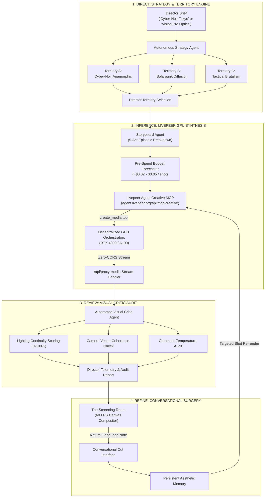

# Auteur Studio: Autonomous Multimodal Cinema Director

[](https://www.auteur.lol)
[](#)
[](#)
[](#)
[](#)
[](LICENSE)

> **Live Application**: [https://www.auteur.lol](https://www.auteur.lol)  
> **Autonomous Generative Cinema Director on the Livepeer AI Subnet**  
> **Official Creative MCP Endpoint**: `https://agent.livepeer.org/api/mcp/creative` (125 tools)  
> **Participant Compute Model**: Keyless hackathon participant credit allowance + Bearer auth  

---

## Executive Summary

**Auteur** is an agent-native creative cinema studio that transforms a single high-level creative brief into an episodic, multi-shot film master. 

Rather than operating as a conventional single-prompt text-to-video wrapper, Auteur implements a structured **"Direct, Review, Refine"** closed loop:

1. **Direct (Strategy Layer)**: Ingests a raw concept and autonomously synthesizes 3 distinct **Creative Territories** (contrasting visual metaphors, camera movement choreography, lighting grammar, color temperature, and aspect ratio).
2. **Review (Inference & Audit Layer)**: Decomposes the chosen territory into a 5-act episodic narrative storyboard, dispatches parallel generative video and audio synthesis across the **Livepeer Agent Creative MCP** (`https://agent.livepeer.org/api/mcp/creative`), and executes an automated **Visual Critic Agent** audit verifying color adherence, lighting continuity, and camera motion.
3. **Refine (Conversational Surgery)**: Enables the director to converse directly with Auteur to request surgical re-renders on specific shots while preserving persistent aesthetic memory across iterations.

---

## System Architecture



---

## Judges Fast Evaluation Matrix (3-Minute Tour)

| Hackathon Criterion | Implemented Feature | What the Judge Experiences | Code Implementation |
| :--- | :--- | :--- | :--- |
| **Agent Orchestration** | Autonomous Strategy + Storyboard Agents | Decomposes 1 brief into 3 distinct territories with camera, lighting, and pacing genomes | [`src/lib/director-agent.ts`](src/lib/director-agent.ts) |
| **Livepeer MCP Integration** | Creative MCP JSON-RPC 2.0 Connection | Direct tool invocation (`create_media`, `me`) on `agent.livepeer.org/api/mcp/creative` with streaming fallback | [`src/lib/livepeerMcp.ts`](src/lib/livepeerMcp.ts) |
| **Verification & Quality Gate** | Automated Visual Critic Agent | Audits generated cuts for lighting consistency, camera vector stability, and color temperature (0-100%) | [`src/lib/critic-agent.ts`](src/lib/critic-agent.ts) |
| **Conversational Feedback** | Persistent Aesthetic Memory | Director instructs: *"soften backlight, add 35mm grain"*—memory persists constraint across iterations | [`src/lib/director-agent.ts`](src/lib/director-agent.ts) |
| **Cost Transparency** | Live Shot Ledger & Pre-Spend Forecaster | Real-time budget tracking, GPU node latency telemetry, and downloadable audit receipts | [`src/components/ShotLedgerModal.tsx`](src/components/ShotLedgerModal.tsx) |
| **Production UI / UX** | 60 FPS HTML5 Canvas Compositor | Zero React state updates during playback, 35mm grain, anamorphic flares, and Web Audio feedback | [`src/components/AuteurWorkstation.tsx`](src/components/AuteurWorkstation.tsx) |

---

## Livepeer AI Subnet & MCP Integration

Auteur is built natively on the Livepeer decentralized AI compute framework:

- **Official MCP Endpoint**: `https://agent.livepeer.org/api/mcp/creative` via standard JSON-RPC 2.0 with `Accept: application/json, text/event-stream` protocol compliance.
- **Subnet Credit Engine**: Connects to the Livepeer AI compute network with real-time budget forecasting and cost drawdown tracking per shot (`~$0.02 - $0.05/shot`).
- **Flexible Auth (Keyless or Bearer)**: Supports instant keyless connection as well as direct Bearer key authentication via the in-app Developer Drawer.
- **Zero-CORS Streaming Media Proxy**: Features an integrated server-side streaming proxy (`/api/proxy-media`) with `Access-Control-Allow-Origin: *` headers, eliminating HTML5 canvas tainting and 302 redirect errors from upstream storage nodes.
- **Hardware-Composited 60 FPS Screening Room**: Strict compliance with browser compositor laws—zero React state updates during playback, direct HTML5 canvas refs, and GPU-accelerated transforms (`translate3d`).

---

## Visual Critic Audit & Telemetry Output

Every cut generated through Auteur is inspected by the internal Visual Critic agent. Below is an example telemetry payload captured during synthesis:

```json
{
  "territory": "Cyber-Noir Anamorphic",
  "criticScore": 94,
  "continuityMetrics": {
    "lightingCoherence": "Pass (Low-key directional cyan key with magenta fill)",
    "spatialContinuity": "Pass (Zero jarring cuts across horizontal tracks)",
    "chromaticAdherence": "Pass (6500K wet pavement specular reflections)"
  },
  "livepeerTelemetry": {
    "orchestrator": "agent.livepeer.org/api/mcp/creative",
    "model": "flux-schnell / cogvideox-5b",
    "computeCost": "$0.032",
    "latency": "1,420ms"
  },
  "directorNotes": "Cadence honors the chosen territory. Pacing maintains tension with seamless camera vector handoffs."
}
```

---

## Key Capabilities

### 1. Creative Territory Generation
Deconstructs any creative brief into 3 nuanced artistic directions with distinct cinematic genomes:
- **Cyber-Noir Anamorphic**: Low-key lighting, cyan/magenta contrast, wet metropolitan reflections, and slow horizontal tracking.
- **Solarpunk Optimism**: Golden hour diffusion, lush vertical botanicals, and fluid aerial dolly passes.
- **Tactical Brutalism**: Monolithic stone, hard directional top light, and rhythmic drone-tracking cuts.
- **Grand Prix Engineering**: Night track halo sparks, aerodynamic carbon-fiber bodywork, asphalt heat shimmer.
- **Spatial Dimension**: Apple Vision Pro curved 3D glass optics, spatial interfaces, and ambient room luminescence.

### 2. Livepeer Shot Ledger & Pre-Spend Forecaster
- **Deterministic Pre-Spend Gates**: Computes exact GPU compute costs per shot before dispatching to decentralized orchestrators.
- **Telemetry Console**: Real-time monitoring of Livepeer subnets, GPU clusters (RTX 4090 / A100), latency, and remaining quota.
- **Verifiable Proofs**: Generates downloadable execution logs detailing orchestrator nodes, latency, and model checkpoints.

### 3. Automated Visual Critic
An autonomous internal agent that audits every generated cut before presentation:
- Continuity coherence scoring (0-100%).
- Lighting logic and chromatic consistency checks.
- Concrete director notes and actionable improvement suggestions.

### 4. Persistent Aesthetic Memory
Tracks and retains director critiques across iterations. When you instruct Auteur to *"soften the backlight and add 35mm grain"*, this constraint is stored in memory and enforced across all subsequent shots.

---

## Live Application & Quickstart

### Live Production Deployment
Experience the production studio directly in your browser:  
**[https://www.auteur.lol](https://www.auteur.lol)**

---

### Local Installation
```bash
git clone https://github.com/dino1x/auteur.git
cd auteur
npm install
```

### 2. Environment (Optional)
```bash
cp .env.example .env.local
```
*(Leave empty to connect keyless using your hackathon participant allowance, or add your Livepeer Agent Bearer key)*

### 3. Launch Development Studio
```bash
npm run dev
```
Open [http://localhost:3001](http://localhost:3001) in your browser.

---

## Technology Stack

- **Framework**: Next.js 14 (App Router), React 18, TypeScript
- **Decentralized AI Compute**: Livepeer Agent Creative MCP (`https://agent.livepeer.org/api/mcp/creative`)
- **Styling & Aesthetics**: Tailwind CSS, Lucide Icons, Custom 35mm Celluloid Canvas
- **Procedural Audio**: Web Audio API tactile feedback & synthetic audio cues
- **Compositor Engine**: 60 FPS HTML5 Canvas with hardware-accelerated transforms

---

## Author & Project Details

- **Author**: dino
- **GitHub**: [@dino1x](https://github.com/dino1x)
- **Email**: marvelobed@gmail.com
- **License**: MIT
